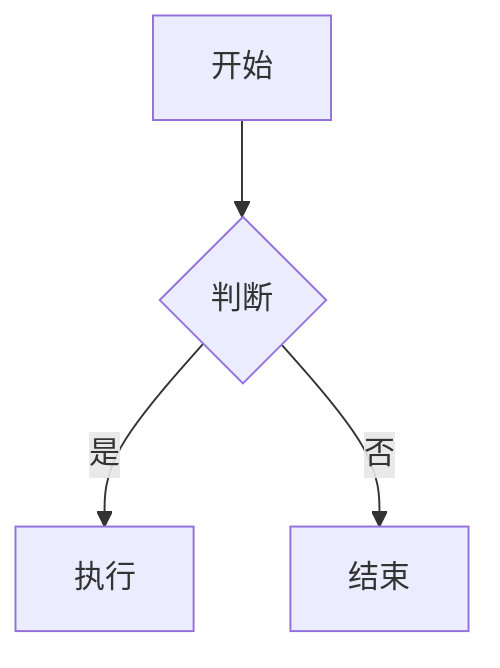

# QLaw Markdown 编辑器 — 项目说明与使用手册

> 版本 1.0.1 | 更新日期：2026-06-17
> 项目地址：https://github.com/MingQiangChen/markdown_editor55

---

## 一、项目简介

QLaw Markdown 是一款基于 Flutter 开发的跨平台 Markdown 编辑器，支持 Windows、macOS、Linux 桌面端和 Web 端。面向需要高效写作的开发者、学生和研究人员，提供实时预览、数学公式渲染、Mermaid 图表、云同步等功能。

### 核心特点

- 🖊️ **所见即所得**：编辑时实时预览渲染效果
- 📐 **数学公式**：行内 `$...$` 和块级 `$$...$$`，基于 KaTeX 渲染
- 📊 **Mermaid 图表**：流程图、时序图、甘特图等实时渲染
- 📁 **文件树**：项目级文件浏览与管理
- 🖼️ **图片插入**：可视化图片插入对话框
- ☁️ **云同步**：WebDAV 同步 + 本地备份
- 📄 **PDF 导出**：支持中文字体，12 种 CSS 模板
- 🌙 **深色/浅色主题**：一键切换
- 🔍 **拼写检查**：英文实时拼写检查与建议
- ⌨️ **丰富快捷键**：格式化、文件操作、视图切换

---

## 二、支持平台

| 平台 | 运行方式 | 状态 |
|------|----------|------|
| Windows 10/11 | 桌面应用 / Web | ✅ 已验证 |
| macOS 10.14+ | 桌面应用 | ✅ CI 通过 |
| Linux (Ubuntu 20.04+) | 桌面应用 | ✅ CI 通过 |
| Web (Chrome/Edge) | 浏览器访问 | ✅ 已验证 |

---

## 三、安装与启动

### 3.1 环境要求

- Flutter SDK ≥ 3.7.2
- Dart SDK ≥ 3.7.2
- Windows 桌面版额外需要：Visual Studio 2022（含 C++ 桌面开发工作负载）
- Linux 桌面版额外需要：`clang cmake ninja-build pkg-config libgtk-3-dev`

### 3.2 获取项目

```bash
git clone https://github.com/MingQiangChen/markdown_editor55.git
cd markdown_editor55
flutter pub get
```

### 3.3 启动方式

**Web 模式（推荐快速体验）：**
```bash
flutter run -d web-server --web-hostname=127.0.0.1 --web-port=5173
```
浏览器打开 `http://127.0.0.1:5173`

**Windows 桌面：**
```bash
flutter run -d windows
```

**Linux 桌面：**
```bash
flutter run -d linux
```

**macOS 桌面：**
```bash
flutter run -d macos
```

### 3.4 构建 Release 版本

```bash
# Windows
flutter build windows --release
# 产物在 build/windows/x64/runner/Release/

# Linux
flutter build linux --release

# macOS
flutter build macos --release

# Web
flutter build web --release
```

---

## 四、功能详解

### 4.1 编辑器核心

#### 主界面布局
- **宽屏（≥600px）**：编辑区与预览区左右分屏显示
- **窄屏（<600px）**：编辑与预览分页切换

#### 格式化工具栏

| 按钮 | 功能 | Markdown 语法 |
|------|------|--------------|
| Heading | 插入标题 | `## ` |
| Bold | 加粗 | `**文本**` |
| Italic | 斜体 | `*文本*` |
| Inline Code | 行内代码 | `` `代码` `` |
| Link | 插入链接 | `[文本](URL)` |
| Quote | 引用 | `> ` |
| List | 无序列表 | `- ` |
| Code Block | 代码块 | ` ``` ` |
| Inline Math | 行内公式 | `$公式$` |
| Math Block | 块级公式 | `$$公式$$` |
| Mermaid | Mermaid 图表 | `` ```mermaid `` |
| Spell Check | 拼写检查开关 | — |
| Code Snippets | 代码片段（分割线、表格、公式等） | — |
| Image | 插入图片 | `` |

#### 键盘快捷键

**格式化：**

| 快捷键 | 功能 |
|--------|------|
| `Ctrl+B` | 加粗 |
| `Ctrl+I` | 斜体 |
| `Ctrl+`` ` | 行内代码 |
| `Ctrl+K` | 插入链接 |

**文件操作：**

| 快捷键 | 功能 |
|--------|------|
| `Ctrl+S` | 保存 |
| `Ctrl+O` | 打开文件 |
| `Ctrl+N` | 新建文档 |

**编辑：**

| 快捷键 | 功能 |
|--------|------|
| `Ctrl+F` | 查找和替换 |

**视图：**

| 快捷键 | 功能 |
|--------|------|
| `Ctrl+Shift+P` | 切换预览显示 |
| `Ctrl+Shift+V` | 循环切换视图模式 |
| `Alt+Z` | 切换自动换行 |

**标签页：**

| 快捷键 | 功能 |
|--------|------|
| `Ctrl+Tab` | 下一个标签页 |
| `Ctrl+Shift+Tab` | 上一个标签页 |
| `Ctrl+W` | 关闭当前标签页 |

### 4.2 多标签文档

- 点击 `+` 或 `Ctrl+N` 新建标签页
- 点击标签页切换文档
- 关闭有未保存更改的标签页时弹出确认对话框
- 每个标签页独立维护编辑状态

### 4.3 文件操作

- **打开**：点击 Open 或 `Ctrl+O`，仅显示 `.md` 文件；支持拖拽 `.md` 文件到窗口打开
- **保存**：点击 Save 或 `Ctrl+S`，打开另存为对话框确认文件名和位置
- **最近文件**：最多保留 10 条记录，按最近打开时间排序
- **外部变更检测**：当文件被外部程序修改时，弹出冲突对话框

### 4.4 文件树（新功能）

- 左侧文件树面板，浏览当前项目目录
- 点击文件名直接打开编辑
- 支持展开/折叠目录

### 4.5 图片插入

- 工具栏点击 Image 按钮打开图片插入对话框
- 支持本地文件选择，图片自动保存到文档同目录 `images/` 文件夹
- 支持输入图片 URL 和替代文本
- 自动生成 Markdown 图片语法 ``
- 支持拖放图片文件到编辑器窗口

### 4.6 表格编辑器（新功能）

- 可视化表格编辑界面
- 支持添加/删除行列
- 自动生成 Markdown 表格语法

### 4.7 任务列表（新功能）

- 支持 `- [ ]` 和 `- [x]` 语法
- 在预览中可直接勾选/取消任务

### 4.8 数学公式

- **行内公式**：用 `$...$` 包裹，如 `$E=mc^2$`
- **块级公式**：用 `$$...$$` 包裹，如：
  ```
  $$
  \int_0^\infty e^{-x^2} dx = \frac{\sqrt{\pi}}{2}
  $$
  ```
- 实时预览基于 KaTeX 渲染
- 导出时可选启用 KaTeX 数学公式渲染

### 4.9 Mermaid 图表

支持 Mermaid.js 语法，实时预览渲染：



支持的图表类型：流程图、时序图、甘特图、饼图、类图等。

导出时可选启用 Mermaid 渲染（需要网络连接加载 CDN 资源）。

### 4.10 查找和替换

- `Ctrl+F` 打开查找栏
- 实时匹配并显示匹配数量
- 支持大小写敏感切换
- 上/下导航匹配项
- 替换当前匹配或全部替换

### 4.11 文档大纲

- 工具栏点击列表图标打开大纲面板
- 自动解析 H1-H6 标题
- 按层级缩进显示
- 点击标题跳转到对应位置

### 4.12 全屏模式

- 工具栏点击全屏图标进入
- 隐藏工具栏和标签栏，只保留编辑区和最小状态栏
- `Esc` 退出全屏

### 4.13 导出

#### HTML 导出
导出为带内嵌样式的完整 HTML 页面。

#### PDF 导出
- 支持中文字体（SimHei 黑体）
- A4 页面格式，32pt 页边距
- 支持标题、列表、引用、代码块、任务列表、表格等

#### CSS 模板（12 种）
| 模板 | 风格 |
|------|------|
| Default | 默认白色 |
| Dark | 深色主题 |
| Minimal | 极简风格 |
| GitHub | GitHub 风格 |
| Solarized | Solarized 配色 |
| Nord | Nord 配色 |
| Dracula | Dracula 配色 |
| Academic | 学术论文 |
| Technical | 技术文档 |
| Newspaper | 报纸排版 |
| Presentation | 演示文稿 |
| Notion | Notion 风格 |

### 4.14 云同步

#### WebDAV 同步
- 支持坚果云、Nextcloud 等 WebDAV 服务
- 配置项：服务器地址、用户名/密码、远程路径
- 支持自动同步（可设置同步间隔）

#### 本地备份
- 同步到本地指定目录
- 可手动输入路径或通过文件夹选择器选择

#### 同步状态
- 面板底部显示同步状态、上次同步时间、同步历史

### 4.15 拼写检查

- 实时检测英文拼写错误（红色下划线标记）
- 编辑器下方显示拼写错误列表
- 提供拼写建议，点击即可自动替换
- ⚠️ 目前仅支持英文

### 4.16 设置面板

| 设置项 | 选项 |
|--------|------|
| 字体大小 | 10-24 号 |
| 字体 | 默认 / Consolas / Courier New / Monaco / Source Code Pro |
| Tab 缩进 | 2 或 4 个空格 |
| 默认视图模式 | 编辑 / 分屏 / 预览 |
| 自动换行 | 开 / 关 |
| 自动保存间隔 | 200-2000 毫秒 |

设置即时生效，自动保存。

### 4.17 状态栏

显示信息：文件名 · 词数 · 字符数 · 保存状态 · 视图模式 · 换行状态 · 行号:列号

示例：
```
report.md · 350 words · 2800 chars · Saved · Split view · Wrap · Ln 42, Col 15
```

---

## 五、数据存储位置

| 数据 | Windows | Linux | macOS | Web |
|------|---------|-------|-------|-----|
| 草稿 | `%APPDATA%\QLawMarkdown\draft.md` | `~/.config/QLawMarkdown/draft.md` | `~/Library/Application Support/QLawMarkdown/draft.md` | localStorage |
| 最近文件 | `%APPDATA%\QLawMarkdown\recent.json` | `~/.config/QLawMarkdown/recent.json` | `~/Library/Application Support/QLawMarkdown/recent.json` | localStorage |
| 设置 | `%APPDATA%\QLawMarkdown\settings.json` | `~/.config/QLawMarkdown/settings.json` | `~/Library/Application Support/QLawMarkdown/settings.json` | localStorage |

> 注意：每次启动时会清除草稿缓存，显示全新的空白编辑界面。

---

## 六、项目架构

```
lib/
├── main.dart                          # 应用入口
├── editor/                            # 编辑器组件
│   ├── editor_screen.dart             # 编辑器主界面
│   ├── editor_toolbar.dart            # 格式化工具栏
│   ├── editor_shortcuts.dart          # 快捷键管理
│   ├── highlighted_editor.dart        # 高亮编辑器
│   ├── markdown_text_editor.dart      # Markdown 文本编辑
│   ├── markdown_editor_highlighter.dart # 编辑器语法高亮
│   ├── markdown_syntax_highlighter.dart # 语法高亮规则
│   ├── markdown_preview.dart          # 实时预览
│   ├── document_outline.dart          # 文档大纲
│   ├── document_stats.dart            # 文档统计
│   ├── document_tab.dart              # 单个标签页
│   ├── document_tab_bar.dart          # 标签栏
│   ├── find_replace_bar.dart          # 查找替换栏
│   ├── insert_image_dialog.dart       # 图片插入对话框 🆕
│   └── markdown_extensions/           # Markdown 扩展
│       ├── math_builder.dart          # 数学公式构建器
│       ├── math_inline_syntax.dart    # 行内公式语法
│       ├── math_block_syntax.dart     # 块级公式语法
│       ├── mermaid_builder.dart       # Mermaid 图表构建器
│       └── mermaid_syntax.dart        # Mermaid 语法
├── file_tree/                         # 文件树 🆕
│   ├── file_tree_node.dart            # 文件树节点
│   └── file_tree_panel.dart           # 文件树面板
├── image_service/                     # 图片服务 🆕
│   ├── image_service.dart             # 图片服务入口
│   └── image_service_base.dart        # 图片服务基类
├── table_editor/                      # 表格编辑器 🆕
│   └── table_editor.dart
├── task_list/                         # 任务列表 🆕
│   └── task_list_editor.dart
├── file_service/                      # 文件操作
│   ├── file_service.dart              # 文件服务入口
│   ├── file_service_base.dart         # 基类
│   ├── file_service_io.dart           # 桌面端实现
│   ├── file_service_web.dart          # Web 端实现
│   └── file_service_stub.dart         # 存根
├── recent_store/                      # 最近文件
│   ├── recent_store.dart
│   ├── recent_store_base.dart
│   ├── recent_store_io.dart
│   ├── recent_store_web.dart
│   └── recent_store_stub.dart
├── storage/                           # 草稿存储
│   ├── document_store.dart
│   ├── document_store_base.dart
│   ├── document_store_io.dart
│   ├── document_store_web.dart
│   └── document_store_stub.dart
├── settings/                          # 设置
│   ├── settings.dart
│   ├── settings_base.dart
│   ├── settings_io.dart
│   ├── settings_web.dart
│   ├── settings_stub.dart
│   └── settings_panel.dart
├── export/                            # 导出
│   ├── export_service.dart            # 导出服务
│   ├── export_options_dialog.dart     # 导出选项对话框
│   └── css_templates.dart             # 12 种 CSS 模板
├── cloud_sync/                        # 云同步
│   ├── cloud_sync.dart                # 同步入口
│   ├── cloud_sync_service.dart        # 同步服务
│   ├── webdav_client.dart             # WebDAV 客户端
│   ├── local_backup.dart              # 本地备份
│   ├── sync_config.dart               # 同步配置
│   ├── sync_settings_panel.dart       # 同步设置面板
│   └── sync_status.dart               # 同步状态
├── spell_check/                       # 拼写检查
│   ├── spell_checker.dart             # 拼写检查器
│   └── spell_check_overlay.dart       # 拼写检查覆盖层
├── custom_theme/                      # 自定义主题
│   ├── custom_theme.dart              # 主题入口
│   └── theme_picker.dart              # 主题选择器
└── templates/                         # 文档模板
    └── document_templates.dart
```

跨平台实现采用条件导出（`dart.library.io` / `dart.library.html`），桌面端和 Web 端各自实现平台特定功能。

---

## 七、依赖说明

| 包名 | 用途 |
|------|------|
| `flutter_markdown_plus` | Markdown 预览（GFM 支持） |
| `markdown` | Markdown → HTML 转换（导出用） |
| `file_picker` | 原生文件选择对话框 |
| `pdf` + `printing` | PDF 生成与分享 |
| `desktop_drop` | 文件拖拽打开 |
| `webview_flutter` | WebView 组件 |
| `http` | HTTP 网络请求 |
| `crypto` | 加密哈希（同步校验） |

---

## 八、开发与验证

### 代码检查
```bash
dart format lib test
flutter analyze
flutter test
```

### CI/CD
项目已配置 GitHub Actions，支持三平台自动构建：
- `build-windows`：Windows Release 构建
- `build-linux`：Linux Release 构建（Ubuntu latest）
- `build-macos`：macOS Release 构建（macOS latest）

每次推送到 `main` 分支自动触发构建，产物上传至 Artifacts。

---

## 九、已知限制

1. 数学公式和 Mermaid 图表的实时预览需要网络连接（加载 CDN 资源）
2. 拼写检查仅支持英文，使用内置词库，准确度有限
3. Web 端保存文件会触发浏览器下载，而非直接写入磁盘
4. PDF 导出的中文排版受 SimHei 字体限制

---

## 十、更新日志

### v1.0.1 (2026-06-17)

**Bug 修复：**
- 修复多标签页 ID 重复导致标签切换/关闭异常
- 修复 WebDAV URL 构造错误导致云同步不可用
- 修复本地备份路径硬编码导致备份/恢复失败
- 修复图片插入后生成空 markdown 语法
- 修复状态栏不显示行号/列号/词数/字符数
- 修复云同步服务初始化不创建客户端、自动同步空回调
- 修复错误消息丢弃异常详情
- 修复 `_formatTime` 返回损坏字符串
- 修复设置面板不显示字体大小和自动保存间隔数值
- 修复代码片段模板中数学公式/Mermaid 语法转义错误

**功能改进：**
- PDF 导出新增代码块渲染和表格解析支持
- 打开文件后自动保存现在正常启动
- 工具栏新增代码片段按钮（分割线、目录、表格模板、任务列表、脚注、公式、Mermaid）
- 图片插入支持 URL 输入和替代文本
- 修复 SpellCheckOverlay 布局约束
- 修复 Mermaid 构建器背景色/文字色/图表内容注入
- 清理 11 个空日志和临时文件

**代码质量：**
- `flutter analyze`: 0 issues
- `flutter test`: 24/24 通过
- 移除未使用的方法和导入

### v1.0.0 (2026-06-16)

- 初始发布
- 支持 Windows 和 Web 平台

---

## 十一、后续规划

- [ ] 更多 CSS 导出模板
- [ ] 大文件性能优化（虚拟滚动）
- [ ] 移动端适配
- [ ] 中文拼写检查
- [ ] 协作编辑
- [ ] Vim/Emacs 键位模式
- [ ] 自定义快捷键绑定
- [ ] 插件系统

---

*本文档由 QClaw 自动生成，基于项目源码分析。*
